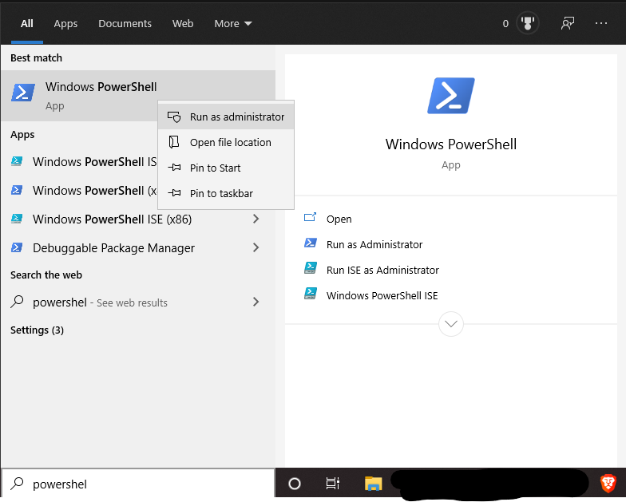

# Welcone to the High-Energy Physics (Doftware) Development Documentation (HEP-DEV-DOCS)

HEP-DEC-DOCS are hosted on https://kreczko.github.io/hep-dev-docs/ and are meant as an overview to get started with software development in HEP.
While most HEP software is written for CentOS (6, 7, 8) with a large set of common depenencies, its development, given a set of tools, can happen on almost any Operating System. This documenatation describes how to install this set of tools to simplify the software setup on Windows, Mac OS and Linux machines.
At the moment of writing, these tools include

- Windows Subsystem for Linux 2 (Windows 10 only) for FUSE support and a Linux environment
  - Windows Terminal
- Docker for running CentOS on any OS
- CVMFS for access to most HEP depenencies via FUSE + HTTP
- Anaconda for Python environments (recommended for Python-only code)

Note that depending on the experiment you are on, you might prefer CVMFS installations of compilers and build tools,
instead of the ones provided by a Docker container or OS.

## Windows Subsystem for Linux 2 (Windows 10 only) for FUSE support and a Linux environment

Since the Windows 10 build version 1903 or higher the Windows Subsystem for Linux 2 (WSL 2) is available.
The most important improvement for HEP is the FUSE support which allows us to mount the global file system, CVMFS.

The installation consists of four parts:

1. Open Powershell with admin rights



2. Install the Windows Subsystem for Linux:

```powershell
dism.exe /online /enable-feature /featurename:Microsoft-Windows-Subsystem-Linux /all /norestart
```

2. 


https://docs.microsoft.com/en-us/windows/wsl/install-win10