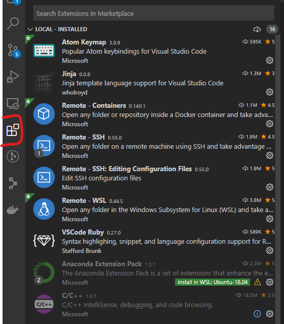
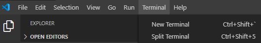
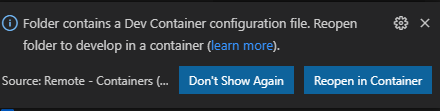

Visual Studio Code (VSCode) is a very versatile Integrated Development Environment (IDE) supporting many programning languages and development tools.
One of the more crucial workflows for HEP are the Docker (or Remote Container) and Remote SSH workflows.
These allow you to run VSCode on the Operating System of your laptop/PC but develop the code in an isolated environment or remote machine respectively.

## Installation

You can download for Windows, Linux (Debian, Ubuntu, Red Hat, Fedora SUSE)) and macOS from its [download page](https://code.visualstudio.com/download).
Once you pick the right package for your OS you will be forwared to the [Getting Started](https://code.visualstudio.com/docs/?dv=osx) which is a very useful resource to familiarize yourself with VSCode.

## Recommended plugins

Software in HEP is most commonly written in [C++](https://www.cplusplus.com/) and [Python](https://www.python.org/) and uses [git](https://git-scm.com/) for version control. Many HEP dependencies also use CMake for building them, which you might be required to do during your research.
Last but not least, documentation is important too: Doxygen and Markdown are the most popular solutions.

As such the most useful plugins for VSCode in HEP are:

- C++ Language Plugin
  - C/C++
  - C++ Intellisense
- Python Language Plugin
- CMake Plugins
  - CMake
  - Cmake Tools
- Docker
  - Docker plugin
  - Remote - Containers
- Git History
- Markdown plugin
  - markdownlint
- Remote SSH

You can search and install these extensions from within VSCode itself by chaning into the extension tab:

### Windows-only

On Windows you will also need the Windows Subsystem for Linux support extension:

- Remote-WSL

## Terminal within VSCode

VSCode also provides a simple Terminal to help you execute commands more easily.
A new terminal can be started by going to the "Terminal" menu item and selecting "New Terminal".

Next to the "New Terminal" text you will also see the currently configured keyboard shortcut for creating a new terminal.

## Using VSCode with Docker

There are two ways to use VSCode with Docker:

1. You can use a container as your [full-time development environment](https://code.visualstudio.com/docs/remote/create-dev-container#_create-a-devcontainerjson-file)
2. You can [attach to a running container](https://code.visualstudio.com/docs/remote/attach-container) to inspect it

VSCode provides a very good [container tutorial](https://code.visualstudio.com/docs/remote/containers-tutorial) for this.

Further information on this topic can be found on the [VSCode Container page](https://code.visualstudio.com/docs/remote/containers).

You might also encounter projects that are already configured to use Docker in VSCode.
In these cases VSCode will ask you if you want to reopen the project in a container:

### Test repository

In order to test your VSCode + Docker setup, you can use the [MPAGS test-setup repository](https://github.com/cpp-pg-mpags/test-setup).
This repository includes a `.devcontainer` folder which will set up a C++ development environment for you.

## Formatting

Formatting your code is not only important for readablity (e.g. spacing) but also ease development in collaborative projects.
In short: if code is always formatted the same way it is easier to traverse and spot important details.

Most languages will provide a configurable way to format the code, e.g. `clang-format` for C++ ([VCode docs](https://code.visualstudio.com/docs/cpp/cpp-ide#_code-formatting)) or `autopep8`/`black` for Python ([VCode docs](https://code.visualstudio.com/docs/python/editing#_formatting)).

## Compiling C++

## Debugging C++
