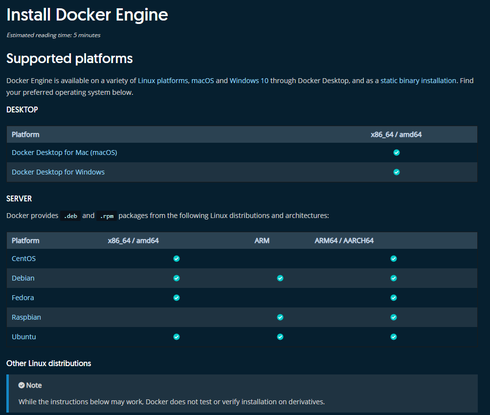
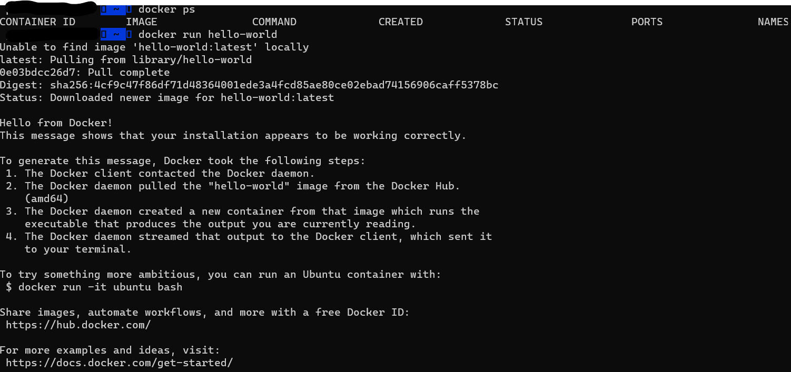

Docker is a useful tool to create specific, isolated enviroments on your machine. 
As most HEP software is currently written for the CentOS distribution, Docker can provide a matching environment independent of your current Linux distribution.
Most Linux distributions should be able to install Docker as long as they have a kernel version qual or newer than 3.10.

## Installing Docker

To install Docker, head to the [Docker docs](https://docs.docker.com/engine/install/) and follow the instructions for your Linux distribution.
It is recommended you install the latest stable version of Docker. To keep it up to date, follow the instructions using the package manager for your distribution.



## Checking the installation

In order to verify, open your terminal and type

```bash
docker ps

docker run hello-world
```

You should see something similar to:


