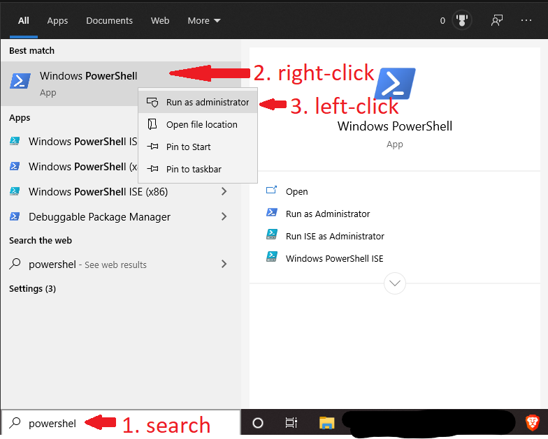

Since the Windows 10 build version 1903 or higher the Windows Subsystem for Linux 2 (WSL 2) is available.
The most important improvement for HEP is the FUSE support which allows us to mount the global file system, CVMFS.
Full installation instructions can be found on the [Official Microsoft Pages](https://docs.microsoft.com/en-us/windows/wsl/install-win10).

The installation consists of four parts:

1. Open Powershell with admin rights:



2. Install the Windows Subsystem for Linux:

```powershell
dism.exe /online /enable-feature /featurename:Microsoft-Windows-Subsystem-Linux /all /norestart
```

3. Enablke "Virtual MAchine Platform"

```powershell
dism.exe /online /enable-feature /featurename:VirtualMachinePlatform /all /norestart
```

4. Set WSL 2 as your default version:

```powershell
wsl --set-default-version 2
```

After this is done, you need to install your Linux distribution of choice: Ubuntu 18.04 or 20.04 are recommended.
This can be done via the Microsoft Store.

Note: CentOS 7 exists in the Microsoft Store, but is not free. Instead, we will use the Ubunutu distribution in combination with Docker
to provide any OS available as docker image (includes CentOS 6-8).
